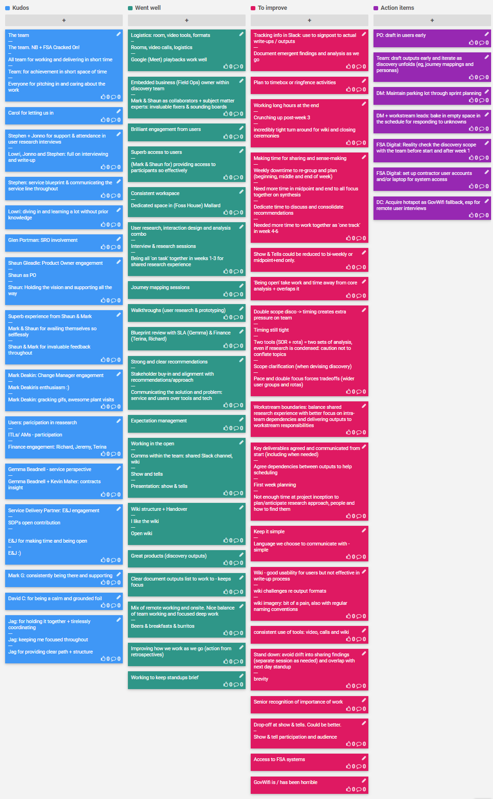

## 18 Dec 2019

## Kudos

* The team
  * The team. NB + FSA Cracked On!
  * All team for working and delivering in short time
  * Team: for achievement in short space of time
  * Everyone for pitching in and caring about the work

* Stephen + Jonno for support & attendance in user research interviews

* Lowri, Jonno and Stephen: full on interviewing and write-up

* Stephen: service blueprint & communicating the service line throughout

* Lowri: diving in and learning a lot without prior knowledge

* Glen Portman: SRO involvement

* Shaun Gleadle: Product Owner engagement
  * Shaun as PO
  * Holding the vision and supporting all the way

* Shaun & Mark for invaluable feedback throughout
  * Superb experience from Shaun & Mark
  * Mark & Shaun for availing themselves so selflessly

* Mark Deakin: Change Manager engagement
  * Mark Deakin's enthusiasm :)
  * Mark Deakin: cracking gifs, awesome plant visits

* Users: participation in reasearch
  * ITLs/ AMs - participation
  * Finance engagement: Richard, Jeremy, Terina
* SLA & Contracts
  * Gemma Beadnell - service perspective
  * Gemma Beadnell + Kevin Maher: contracts insight
* Service Delivery Partner:  E&J engagement
  * SDP's open contribution
  * E&J for making time and being open
  * E&J :)

* Mark G: consistently being there and supporting
* Carol for letting us in
* David C: for being a calm and grounded foil and team anchor
* Jag for
  * holding it together + tirelessly coordinating
  * keeping me focused throughout
  * providing clear path + structure

## Went well

- Logistics
  - room, video tools, formats
  - Rooms, video calls, logistics
  - Google (Meet) playbacks work well
- Embedded business (Field Ops) owner within discovery team
  - Mark & Shaun as collaborators + subject matter experts: invaluable fixers & sounding boards
- Brilliant engagement from users
  - Superb access to users 
  - (Mark & Shaun for) providing access to participants so effectively
- Consistent workspace 
  - Dedicated space in (Foss House) Mallard
- Interview & research sessions
  - User research, interaction design and analysis combo
  - Being all 'on task' together in weeks 1-3 for shared research experience
- Playback and group sense-making
  - Journey mapping sessions
  - Walkthroughs (user research & prototyping)
  - Blueprint review with SLA (Gemma) & Finance (Terina, Richard)
- Strong and clear recommendations
  - Stakeholder buy-in and alignment with recommendations/approach
  - Communicating the solution and problem: service and users over tools and tech
- Expectation management
- Working in the open
  - Comms within the team: shared Slack channel, wiki
  - Show and tells
  - Presentation: show & tells
- Wiki structure + Handover
  - "I like the wiki"
  - Open wiki
- Great products (discovery outputs)
- Clear document outputs list to work to - keeps focus
- Mix of remote working and onsite. Nice balance of team working and focused deep work
  - Beers & breakfasts & burritos
- Improving how we work as we go (taking action from retrospectives)
- Working to keep standups brief

## To improve

- Tracking info in Slack
  - use to signpost to actual write-ups / outputs
  - Document emergent findings and analysis as we go
- Plan to timebox or ringfence activities
  - Working long hours at the end
  - Crunching up post-research phase
  - incredibly tight turn around for wiki and closing ceremonies
- Making time for sharing and sense-making 
  - Weekly downtime to re-group and plan (beginning, middle and end of week)
  - Need more time in midpoint and end to all focus together on synthesis
  - Dedicate time to discuss and consolidate recommendations
  - Needed more time to work together as 'one track' in week 4-6
  - 'Being open' takes work and time away from core analysis + overlaps it
- Timing still tight
  - Double scope disco -> timing creates extra pressure on team
  - Two tools (SOR + rota) = two sets of analysis, even if research is condensed: caution not to conflate topics
  - Scope clarification (when devising discovery)
  - Pace and double focus forces tradeoffs (wider user groups and rotas)
- Workstream boundaries: balance shared research experience with better focus on intra-team dependencies and delivering outputs to workstream responsibilities
- First week planning
  - Agree dependencies between outputs to help scheduling
  - Key deliverables agreed and communicated from start (including when needed)
  - Not enough time at project inception to plan/anticipate research approach, people and how to find themAction items
- Keep it simple. Language we choose to communicate with - simple.
- Wiki
  - good usability for users but not effective in write-up process
  - challenges re output formats
  - imagery: bit of a pain, also with regular naming conventions
- Consistent use of tools: video, calls and wiki
- Stand down
  - avoid drift into sharing findings (separate session as needed) and overlap with next day standup
  - brevity
- Show & tell 
  - Drop-off at show & tells. Could be better.
  - participation and audience
  - Could be reduced to bi-weekly or midpoint+end only.
- Access to FSA systems
- GovWifi is / has been horrible
- Senior recognition of importance of work

## Actions

- [ ] PO: draft in users early
- [ ] Team: draft outputs early and iterate as discovery unfolds (eg, journey mappings and personas)
- [ ] DM: Maintain parking lot through sprint planning
- [ ] DM + workstream leads: bake in empty space in the schedule for responding to unknowns
- [ ] FSA Digital: Reality check the discovery scope with the team before start and after week 1
- [ ] FSA Digital: set up contractor user accounts and/or laptop for system access
- [ ] DC: Acquire hotspot as GovWifi fallback, esp for remote user interviews

