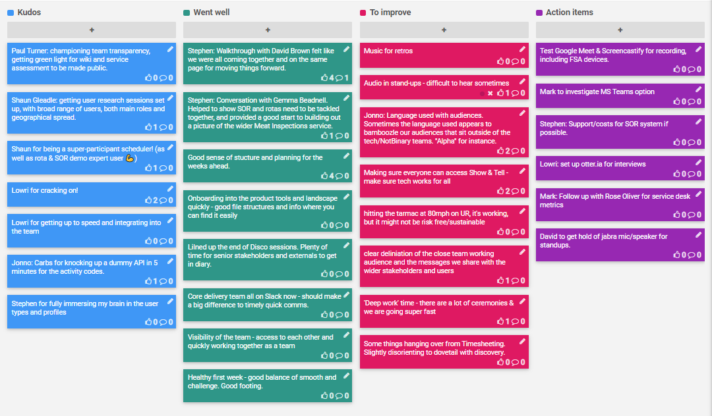
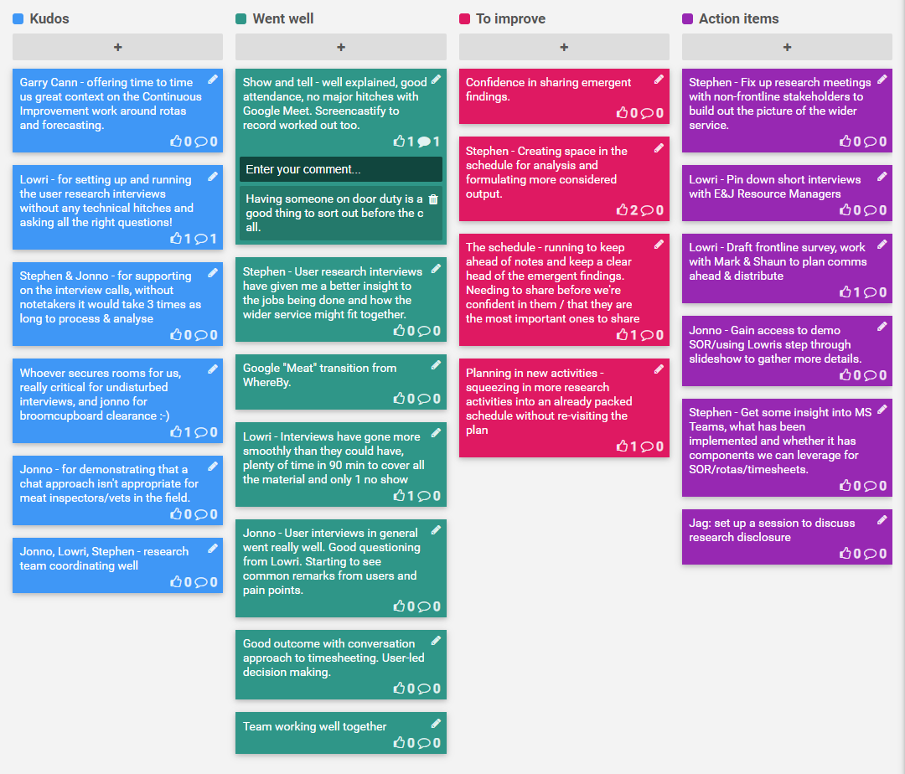
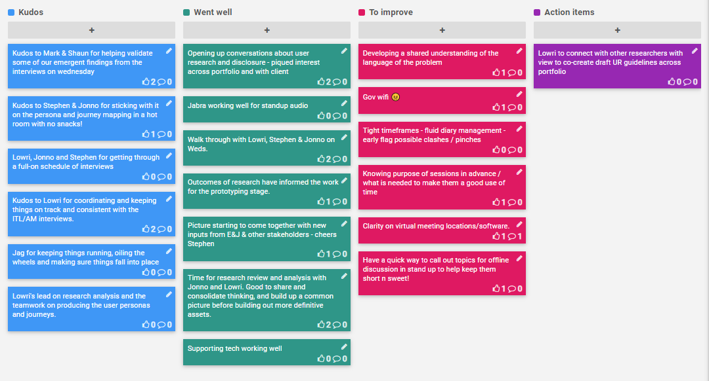
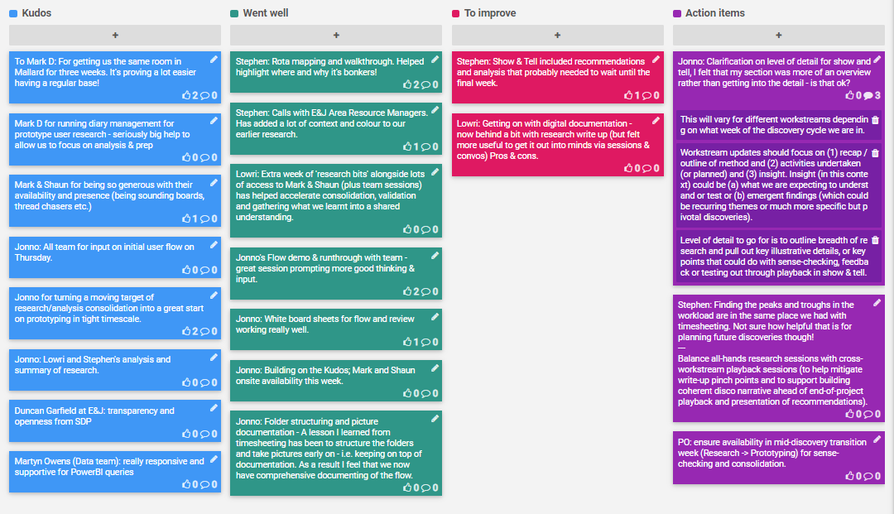

A retrospective is a ceremony held by an agile team at the end of each sprint to openly discuss what is going well and what needs improvement. It's a key activity to help the team iteratively improve their working culture.

[TOC]

## Sprint 1 (4-8 Nov 2019)
[]

## Sprint 2 (11-15 Nov 2019)

## Sprint 3 (18-22 Nov 2019)

## Sprint 4 (25-29 Nov 2019)

## [Sprint 5 (2-6 Dec 2019)](Sprint-5-Retrospective)

## [Sprint 6 (9-17 Dec 2019)](Sprint-6-Retrospective)

## [Full Discovery Retrospective](Discovery-Retrospective)
