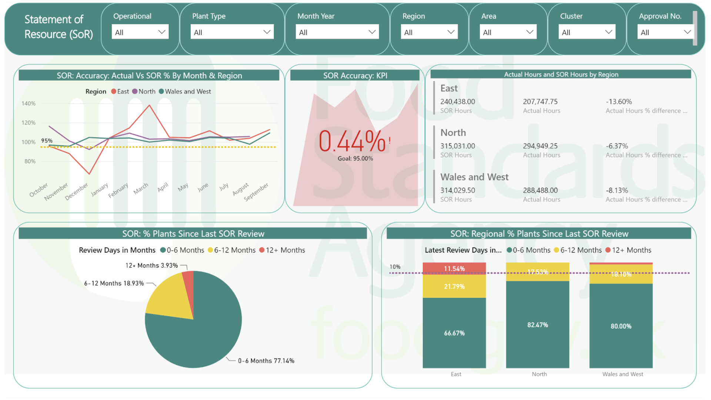

The SOR Accuracy report shows the number of hours expected to be worked (as recorded against a plant's Statement of Resource) vs the number of activity hours reported through timesheeting.  

It is intended to indicate how accurately Statements of Resource have been drawn up, and to be used in conjunction with timely annual reviews. 

The report is accurate insofar as the data points compared are correctly recorded through the timesheeting and SOR systems. However, **the granularity of the data is coarse**. 

The report has no narrative texture and is **missing context** to make it usefully actionable, such as:
* daily operational profiles (eg, weekly religious days)
*  hours by grade and hours by activity (G-I-N)
* throughput variance (eg, TimePut view)

Much of this data is not transferred from operating databases into the PowerBI reporting datastore, so it is unavailable to report against. 

Apart from useful contextual data not being available, headline hours is a relatively crude indicator of the accuracy of plant resourcing needs. **Comparing activity logged to actual throughput** could give be a clearer metric for the action and outcome that the report is intended to enable - which is more accurate resourcing profiles for meat plant establishments, in order to drive more efficient workforce allocation at a better cost threshold for the FBO and FSA. 

