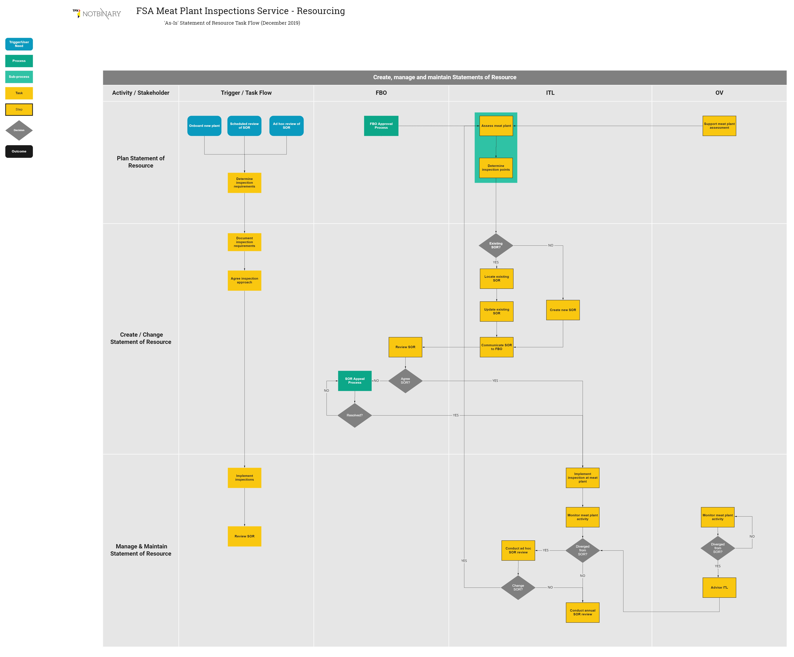

## Understand the SOR process & task flow
The flow diagram gives a high-level view of the activities involved in creating and maintaining the Statement of Resource documents that enable the meat plant inspection service.

It helps highlight the handover points between stakeholders in the process and the relationship with other processes and activities.

Note that the flow shows the "as is" process which has been explored as part of the Discovery work around inspection resourcing, and is current at December 2019.

The [User Needs](sor-user-needs), [User Journey](sor-user-journey) and [Pains & Opportunities](sor-pains-and-opportunities) pages provide the context for this process flow.

The Prototypes page provides the step-by-step detail of completing an SOR (and ideas for improving the interface and flow).

***

### Meat Plant Inspection - SOR process flow

