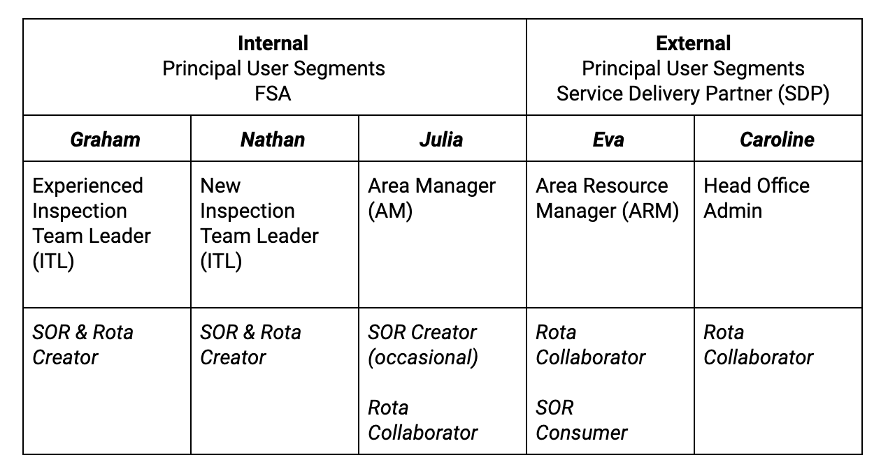
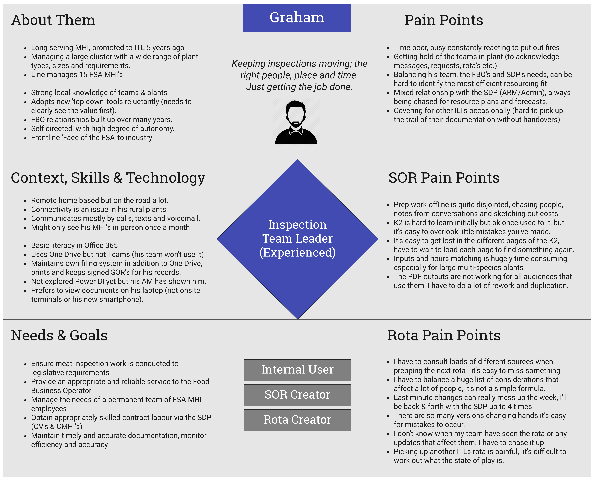
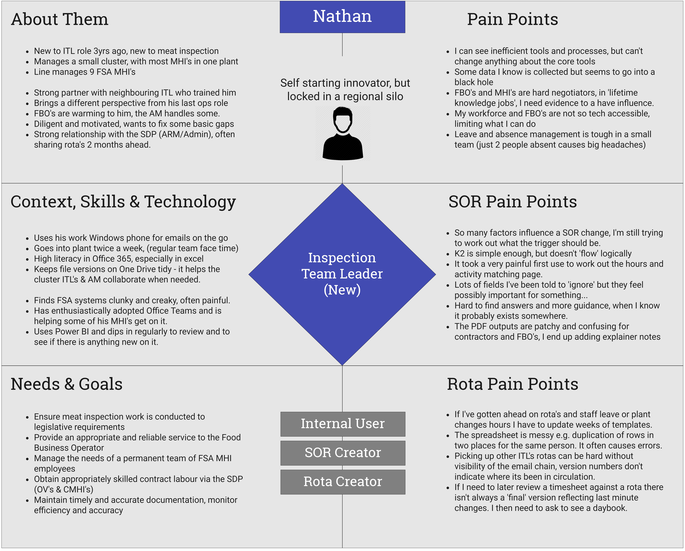
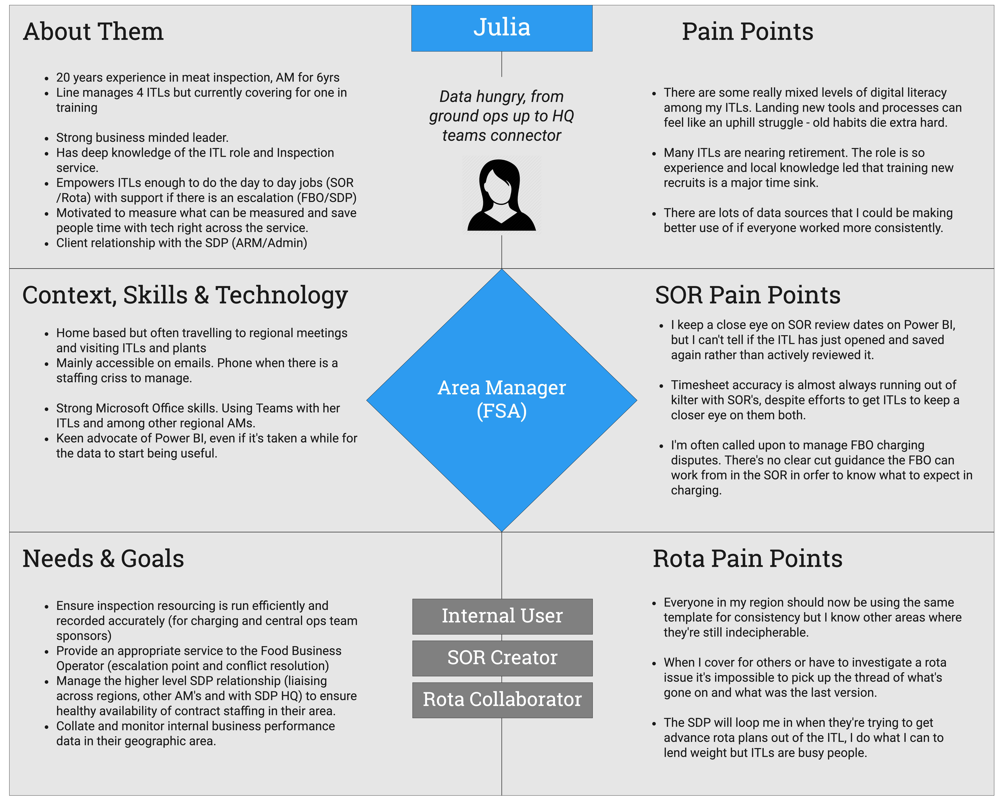
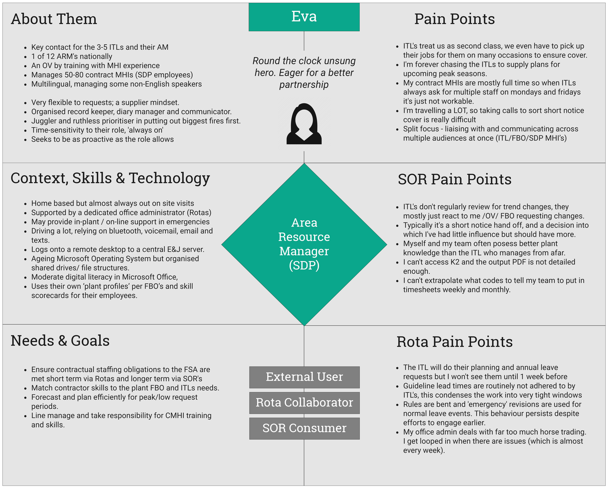
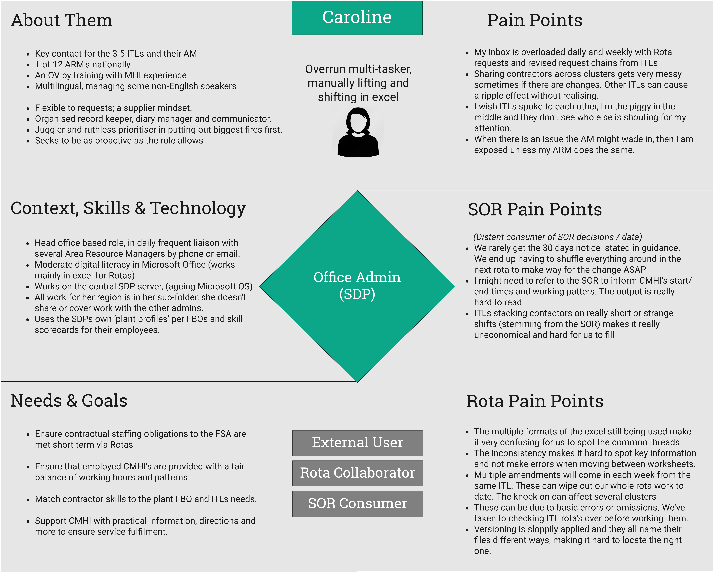

## SOR user segments
Three key [User Segments](users-and-stakeholders#user-segments) were identified as key users (creators or collaborators) of the SOR system and its outputs.

* Inspection Team Leaders
* Area Managers
* Area Resource Managers (Service Delivery Partner)

## SOR personas

Data collected through in-depth one-on-one research interviews was used to compile representative User Personas. These capture the essential information about these users, their roles, needs, goals, and specific pain points in the SOR creation or collaboration process.

To learn more about personas and their role in user-centred design read about them [here](user-research#about-personas).

Core persona details follow below.  
[Download a full-size version of all personas](https://drive.google.com/a/notbinary.co.uk/file/d/19HdVPE_6yfBY7MSDTY56HvDqgjyF0cDW/view?usp=sharing) (pdf)

Additionally, Inspection Team Leaders and Area Resource Managers are discussed in [further detail here](personas).

### Graham - Experienced Inspection Team Leader

Long standing MHI and then ITL, managing a large and complex cluster. Very time poor, has low expectations of technology. Just gets the job done.

### Nathan - New Inspection Team Leader

New to industry ITL, smaller area, with transferred in-skills. Attempts to innovate locally but throttled by ageing tech & not joined up processes.

### Julia - Area Manager (FSA)

Long standing ITL, now an AM. Deep sector experience. Diligent in monitoring their area, developing & supporting ITLs. Outlook bridges Field Ops and HQ.

### Eva - Area Resource Manager (Service Delivery Partner)

ARM managing 3-5 ITLs. Key SOR consumer (forecasting & fulfilment) and Rota firefighter. Always ‘on’ availability, also managing own workforce’s needs. 

### Caroline - Office Administrator (Service Delivery Partner)

Office based support to ARM. Primary rota recipient and collaborator, dealing with the worst of rota workflow inefficiencies. 

## **SOR User Needs**
### ITL Personas - Graham & Nathan

See Needs in context of the [SOR User Journey Map](sor-user-journey).
#### Preparation
*   I need to monitor the current SOR for fit to the FBO's needs over time so that labour is being used efficiently
*   I need to balance providing a timely staffing service to the FBO and being flexible to market needs, with the FSA and SDP’s resourcing capabilities and constraints
*   I need to decide whether a change to the SOR is required or not based on the impact of a change on inspection work
*   I need to understand what availability and flexibility my team and the SDP contract team have in order to meet FBO change requests
*   I need to understand the cost implications of different ratios of employed/contract staff working different shift patterns (impact on overtime rates, unsocial hours etc)
*   I need to canvas opinion from the FBO, my team and the SDP on proposed SOR changes 
*   I need to conduct scoping and preparation work offline, often from rural locations with poor connectivity
#### Data Entry
*   I need to reuse large amounts of information when only small changes are being requested, without onerous rework
*   I need to record the particulars of the discussed and agreed new model so that it is documented for both parties and any future query can be traced
*   I need to record local staff contract specifics such as overtime rates and shift allowances that  will have a bearing on what the FBO is charged
*   I need to estimate the volume of staff the plant will need to work the change (based on my experience and local knowledge)
*   I need to know current and realistic throughput, line speed and inspection point information about the site, so that the SOR reflects what will actually be worked
*   I need to indicate in the SOR which roles will be performing which chargeable and non chargeable tasks per day so that the FBO is charged correctly
#### Handoff
*   I need to distribute the SOR agreement to all relevant parties, so that there is a shared understanding of its impact
*   I need to give my staff, the FBO and Service Delivery Partner visibility of new working hours and patterns
*   I need to give the SDP visibility of activity breakdowns in hours so that they can allocate appropriately skilled workers where they are required

