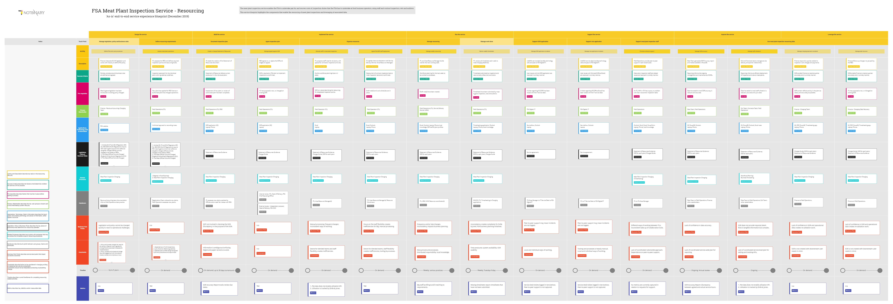

Understand the service blueprint
Business analysts and service designers take all the things that are needed to make a service work (such as people, processes, technology) and put them in context. The service blueprint is a way of collating and summarising that information in a single page.

This blueprint gives an end-to-end view of everything that should be considered to make the resourcing part of meat plant inspections work efficiently and effectively.

The context for the blueprint is the broader meat plant inspection process and the need to charge for services provided to Food Business Operators and conducted on behalf of the Government.

Each card on the blueprint contains a brief statement. These act as triggers for anyone involved in designing or running the service.

The blueprint addresses a service-level view; the user-level experience is addressed elsewhere in user segments, personas, and user stories.

Service lifecycle, stages, and activities
Each column in the blueprint represents a stage in the service lifecycle. They show the events that make up how we create SORs and manage rotas. SORs and rotas are used to answer the questions:

How many inspection points are needed in a plant?
How many inspectors and vets are needed to allow the plant to operate its proposed production hours?
How do we organise inspection teams so that the right people turn up in the right place at the right time?
The blueprint also includes activities that leverage the information in SORs and/or rotas, particularly where they are used as part of the charging process.

Based on research and analysis in November and December 2019, the blueprint has been designed around the following stages and activities that make up the resourcing part of the Meat Plant Inspection service:

Manage legislation, policy and business rules

Define FSA policy and procedures
Define resourcing requirements

Assess meat plant operations
Document inspection plan

Create or change Statement of Resources
Organise resources

Allocate staff to meat plant inspection
Agree FSA/SDP staff deployment
Manage resourcing

Manage weekly resourcing
Manage work done

Review weekly timesheets
Support SOR application

Manage SOR application incidents
Support rota application

Manage rota application incidents
Support meat plant inspection staff

Provide on-the-job support
Use meat plant inspection resourcing data

Manage SOR accuracy
Manage staff utilisation
Manage charging/payment complaint
Manage debt recovery
Themes
Each row in the blueprint represents a theme, such as the activity; success criteria; and the information and/or technology being used.

This means we can cross-reference factors across the lifecycle of the service and keep the bigger picture in mind.