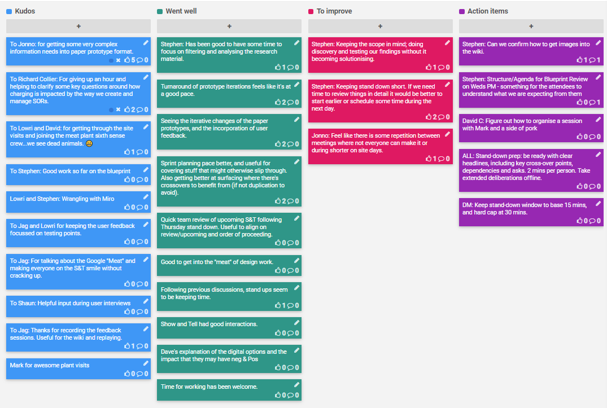

## 2-6 Dec 2019

## Kudos

- To Jonno: for getting some very complex information needs into paper prototype format.
- To Richard Collier: For giving up an hour and helping to clarify some key questions around how charging is impacted by the way we create and manage SORs.
- To Lowri and David: for getting through the site visits and joining the meat plant sixth sense crew...we see dead animals.  😬
- To Stephen: Good work so far on the blueprint
- Lowri and Stephen: Wrangling with Miro
- To Jag and Lowri for keeping the user feedback focussed on testing points.
- To Jag: For talking about the Google "Meat" and making everyone on the S&T smile without cracking up.
- To Shaun: Helpful input during user interviews
- To Jag: Thanks for recording the feedback sessions. Useful for the wiki and replaying.
- Mark for awesome plant visits

## Went well

- Stephen: Has been good to have some time to focus on filtering and analysing the research material.
- Turnaround of prototype iterations feels like it's at a good pace.
- Seeing the iterative changes of the paper prototypes, and the incorporation of user feedback.
- Sprint planning pace better, and useful for covering stuff that might otherwise slip through. Also getting better at surfacing where there's crossovers to benefit from (if not duplication to avoid).
- Quick team review of upcoming S&T following Thursday stand down. Useful to align on review/upcoming and order of proceeding.
- Good to get into the "meat" of design work.
- Following previous discussions, stand ups seem to be keeping time.
- Show and Tell had good interactions.
- Dave's  explanation of the digital options and the impact that they may have neg & Pos
- Time for working has been welcome.

## To improve

- Stephen: Keeping the scope in mind; doing discovery and testing our findings without it becoming solutionising.
- Stephen: Keeping stand down short. If we need time to review things in detail it would be better to start earlier or schedule some time during the next day.
- Jonno: Feel like there is some repetition between meetings where not everyone can make it or during shorter on site days.

## Action items

- [ ] Stephen: Can we confirm how to get images into the wiki.
- [ ] Stephen: Structure/Agenda for Blueprint Review on Weds PM - something for the attendees to understand what we are expecting from them
- [ ] David C: Figure out how to organise a session with Mark and a side of pork
- [ ] ALL: Stand-down prep: be ready with clear headlines, including key cross-over points, dependencies and asks. 2 mins per person. Take extended deliberations offline.
- [ ] DM: Keep stand-down window to base 15 mins, and hard cap at 30 mins.