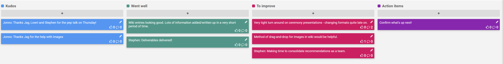

## 9-17 Dec 2019

## Kudos

- Jonno: Thanks Jag, Lowri and Stephen for the pep talk on Thursday!
- Jonno: Thanks Jag for the help with images

## Went well

- Wiki entries looking good. Lots of information added/written up in a very short period of time.
- Stephen: Deliverables delivered!

## To improve

- Very tight turn around on ceremony presentations - changing formats quite late on.
- Method of drag-and-drop for images in wiki would be helpful.
- Stephen: Making time to consolidate recommendations as a team.

## Action items

- [ ] Confirm what's up next!