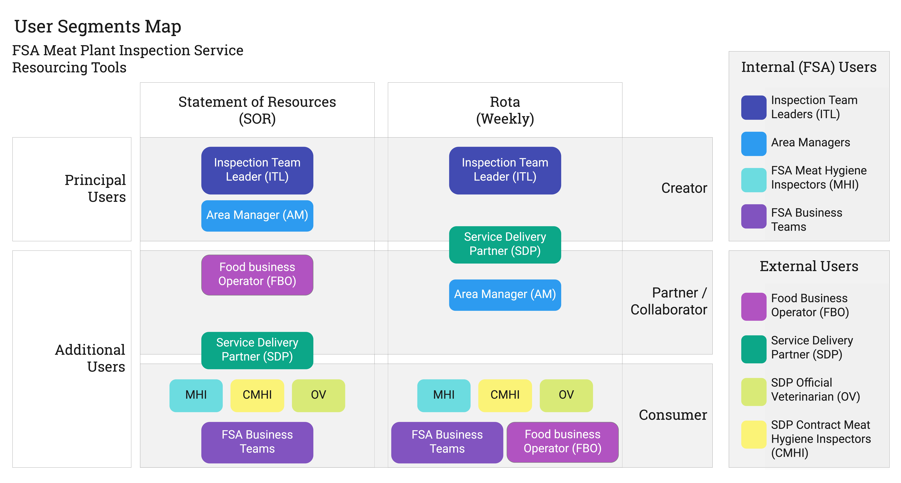

## Segments Overview
### Service Stakeholders
The service stakeholders identified for this discovery cover the roles and/or teams involved in defining the level of inspection required at each meat plant and coordinating staff to deliver those inspections.

### User Segments
The User Segments identified for this discovery cover the roles and/or teams involved in directly creating, editing, consulting on and consuming two specific resourcing tools, namely the Statement of Resources and the Rota.

These User Segments are illustrated below and are categorised in 3 ways:
1. Principal user group or an additional user group (by tool)
2. Role as creators, collaborators or consumers of the tool and its outputs (by tool)
3. Internal to the FSA or an External party (i.e. Food Business Operator or Service Delivery Partner) 

#### Principal User Segments
SOR & Rota - Resourcing Tooling

 * FSA - Inspection Team Leaders 
 * FSA - Area Managers 
 * Service Delivery Partner - Area Resource Manager 
 * Service Delivery Partner - Office Administrator

#### Additional User Segments 
SOR & Rota - Resourcing Tooling

 * Food Business Operator (FBO)
 * Meat Inspectors (FSA) 
 * Contract Meat Inspectors (Service Delivery Partner)
 * Contract Official Veterinarians (Service Delivery Partner)
 * Business Teams (FSA) 

These User Segments are further explored and illustrated as Personas for [Statements of Resource](sor-user-needs) and [Rotas](rota-user-needs).

***

## Understand the stakeholder mapping
For each stakeholder, the mapping describes their role and influence on the service, and their objective or interest in ensuring the service operates successfully.

Note that the focus is on the resourcing part of the service, not the inspections service itself or other components of the service such as timesheeting which is dealt with elsewhere.

### Stakeholder mapping for meat plant inspection resourcing

To view a PDF of the stakeholder mapping, go to:

https://drive.google.com/open?id=1Msgep-0qJgJlbwmaMf2bckM3pwlf4SRm

